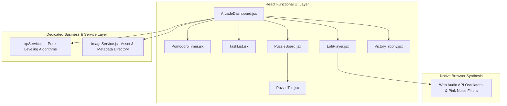

# 🌳 Pomodoro Puzzle Studio | Gamified AI Productivity & Lofi Arcade


A high-performance, studio-grade productivity suite inspired by top-tier focus applications like **Forest** and **Lofi Girl**. Combining gamified Pomodoro study sessions with responsive digital artwork wallpaper matrix unlocking, built-in ambient Web Audio Lofi Radio synthesizers, and seamless holographic styling.

---

## 🌟 Key Product Features & Design Psychology (The 'Why')

1. **The Authoritative Hero Centerpiece (`7.5rem` Free-Floating Timepiece):**
   * **The 'Why':** Serious productivity tools require a clear visual hierarchy. By removing bulky containment boxes and anchoring massive countdown typography directly in the center of the display over high-definition wallpapers, users experience immediate focus immersion.
2. **Dynamic Matrix Wallpaper Revelation:**
   * Completing Pomodoro intervals or checking off todos gradually melts away frosted matrix fog from your screen, slice by slice, uncovering stunning desktop artwork (*Cyberpunk City*, *Neon Supercar*, and *Anime Landscape*).
   * Includes a smart center-out reveal algorithm that illuminates prominent visual quadrants first.
3. **Integrated Web Audio Lofi Radio Synthesizer (`LofiPlayer.jsx`):**
   * Built directly into the collapsible side studio drawer. Leverages standard browser Web Audio API generators to synthesize soothing **Cyberpunk Rain** (low-pass pink noise), **Highway Hum**, and relaxing lofi melody progressions without external tabs or streaming bottlenecks.
4. **Gamified Focus XP & Rank Progression:**
   * Every completed task awards **+250 XP**, advancing users through competitive rank tiers (*Level 1 Novice Scripter* ➔ *Level 2 Cyber Ninja* ➔ *Level 3 Neo-Tokyo Legend*) with automated end-of-session **Victory Flex Social Trophy Cards**!
5. **1-Click Wallpaper Inspect & Collapsible Study Studio Drawer:**
   * With a click of the **"📁 STUDY STUDIO"** tab or pressing **ESC**, all interactive UI panels smoothly slide off-screen or dissolve, leaving a 100% unobstructed view of the earned desktop artwork.

---

## 🏗️ System Architecture & Engineering Standards



### Strict Frontend Standards Applied:
* **Separation of Concerns:** Zero business calculation logic inside UI components. All gamification math (`xpService.js`) and asset descriptions (`imageService.js`) live in dedicated service layers for simplified testing and debugging.
* **The "Seamless React Bounce" CSS Reset:** Strictly enforces `margin: 0; padding: 0; width: 100%; min-height: 100vh;` on `html, body, #root` with solid HSL backdrop coloring to eliminate harsh white edges during browser scroll bounce behaviors.
* **100% Automated Testing Validation (The "No-Mistakes Pipeline"):** All gamification thresholds, timer intervals, and dynamic matrix sizing formulas are covered by robust Vitest unit test suites (`src/specs/*.test.js`).

---

## 🚀 Getting Started & Local Development

### 1. Installation
Clone the repository and install project dependencies via npm:
```bash
git clone https://github.com/1himanshu1804442/pomodoro-puzzle-studio.git
cd pomodoro-puzzle-studio
npm install
```

### 2. Run Local Development Server
Start the ultra-fast Vite development environment with Hot Module Replacement:
```bash
npm run dev
```
Navigate to `http://localhost:5173/` in your browser.

### 3. Run Automated Test Suites
Verify application logic integrity using Vitest:
```bash
npx vitest run
```

---

## 📸 Interactive Showcase
* **Free-Play Mode:** When your checklist is clear (`tasks = 0`), the studio opens up in full widescreen artwork view so you can enjoy high-definition wallpapers instantly.
* **Studio Drawer Control:** Docked seamlessly on the right edge, keeping tasks and ambient soundscapes readily accessible without obstructing your central viewing axis.

---
*Built with React, Vite, Web Audio API, and Vanilla CSS by @1himanshu1804442*
