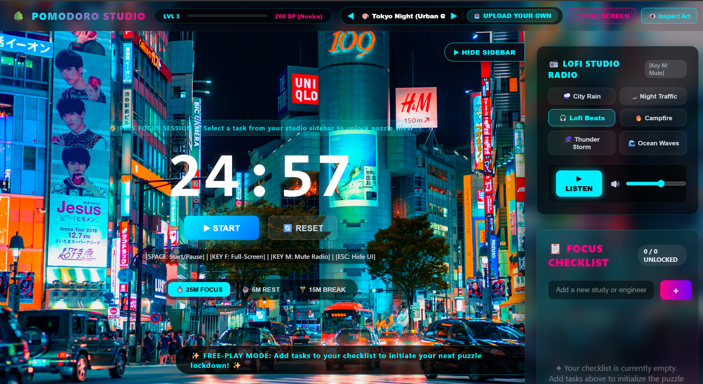
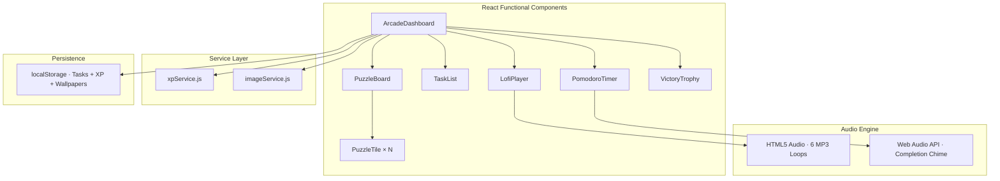

<div align="center">

# 🌳 Pomodoro Studio

### *A Gamified Focus Timer That Rewards Your Productivity*

**Unlock stunning HD wallpaper puzzles as you complete tasks. Stay focused with ambient lofi soundscapes.**

[](http://localhost:5173/)
[](https://react.dev/)
[](https://vite.dev/)
[](https://vitest.dev/)

---



*Tokyo Night theme · 25-minute focus session · Lofi Beats playing · Full-screen immersion mode*

</div>

---

## ✨ What Makes This Different

Most Pomodoro apps are boring countdown clocks. **Pomodoro Studio** transforms focus sessions into a visual reward system inspired by [Forest](https://www.forestapp.cc/) and [LifeAt](https://www.lifeat.io/):

| Feature | Description |
|---------|-------------|
| 🧩 **Puzzle Rewards** | Each completed task reveals a piece of a hidden HD wallpaper. Complete all tasks to unlock the full masterpiece. |
| 🎧 **6-Channel Lofi Radio** | Studio-recorded ambient soundscapes — City Rain, Campfire, Ocean Waves, Lofi Beats, Thunder Storm, Night Traffic. |
| 📸 **10 HD Themes** | Curated real-world photography from Tokyo streets to Alpine forests to the Northern Lights. |
| 📤 **Custom Wallpapers** | Upload your own images and use them as puzzle backgrounds. |
| ⛶ **Full-Screen Mode** | Edge-to-edge distraction-free immersion. Press `F` to toggle. |
| 🏆 **XP & Leveling** | Earn 50 XP per completed task. Level up from *Novice* → *Apprentice* → *Adept* → *Master*. |
| 🔔 **Smart Notifications** | Audible bell chime + browser notification when your timer completes, even if you switched tabs. |
| 💾 **Persistent Progress** | Tasks and XP survive page refreshes via localStorage. |
| ⌨️ **Keyboard Shortcuts** | `SPACE` start/pause · `F` fullscreen · `M` mute radio · `ESC` hide UI |

---

## 🎨 Theme Gallery

<div align="center">

| ⛩️ Tokyo Night | 🌲 Misty Alps | 🌿 Kyoto Garden |
|:---:|:---:|:---:|
| Urban Cyberpunk | Alpine Nature | Zen Nature |

| ☕ Cozy Cafe | 🌌 Milky Way | 🏙️ Manhattan Sky |
|:---:|:---:|:---:|
| Minimalist Study | Astronomy | Urban Skyline |

| 🌧️ Rainy Window | 🏖️ Amalfi Sunset | 🏔️ Aurora Borealis | 🏎️ Night Highway |
|:---:|:---:|:---:|:---:|
| Cozy Atmosphere | Coastal Peace | Ethereal Nature | Midnight Drive |

</div>

---

## 🏗️ Architecture



### Design Decisions

- **Strict Layered Architecture** — Zero business logic inside UI components. XP math and image metadata live in dedicated service files for clean testing and debugging.
- **One-Way Task Completion** — Completed tasks cannot be unchecked to prevent XP duplication exploits.
- **Cross-Browser Fullscreen** — Supports standard `requestFullscreen()`, WebKit, and MS vendor prefixes.
- **Seamless React Bounce** — CSS reset eliminates white edges during mobile scroll bounce by applying solid dark backgrounds to `html, body, #root`.

---

## 🚀 Quick Start

```bash
# Clone the repo
git clone https://github.com/1himanshu1804442/pomodoro-puzzle-studio.git
cd pomodoro-puzzle-studio

# Install dependencies
npm install

# Start the dev server
npm run dev
```

Open [http://localhost:5173](http://localhost:5173) in your browser.

### Run Tests

```bash
npx vitest run
```

```
 ✓ src/specs/timer.test.js          (2 tests)
 ✓ src/specs/puzzleMath.test.js     (4 tests)
 ✓ src/specs/storage.test.js        (4 tests)
 ✓ src/specs/gamification.test.js   (5 tests)

 Test Files  4 passed (4)
      Tests  15 passed (15)
```

---

## ⌨️ Keyboard Shortcuts

| Key | Action |
|-----|--------|
| `Space` | Start / Pause timer |
| `F` | Toggle full-screen mode |
| `M` | Mute / unmute lofi radio |
| `Esc` | Hide UI (wallpaper inspect mode) |

---

## 🛠️ Tech Stack

| Layer | Technology |
|-------|-----------|
| **Framework** | React 19 (Functional Components + Hooks) |
| **Build Tool** | Vite 8 |
| **Styling** | Vanilla CSS + Glassmorphism Design System |
| **Audio** | HTML5 `<audio>` (ambient loops) + Web Audio API (chime) |
| **Testing** | Vitest 4 + Testing Library |
| **Persistence** | localStorage (Tasks, XP, Custom Wallpapers) |
| **Notifications** | Browser Notification API |

---

<div align="center">

**Built with ☕ and focus by [@1himanshu1804442](https://github.com/1himanshu1804442)**

*If this helped you stay focused, consider giving it a ⭐*

</div>
